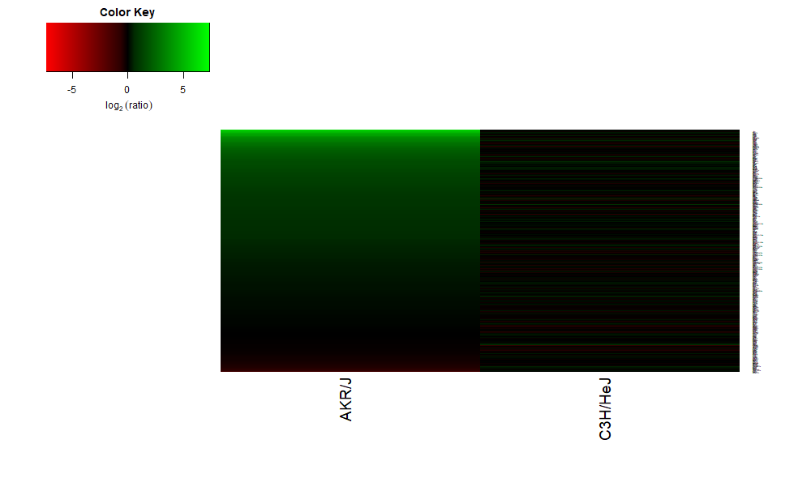

# lps_macrophages
Analyzing Affymetrix microarray data using R.

The "m1.R" file analyzes M1 macrophage marker expression from two different strains of mice (AKR/J and C3H/HeJ) following LPS (lipopolysaccharide) treatment. The source of this microarray data is the Gene Expression Omnibus (GEO) repository (https://www.ncbi.nlm.nih.gov/geo/), using the accession numbers provided in the .R file. The experimental design and dataset are also described there.

The resulting M1 marker expression heat map from the "m1.R" file is shown below. These two strains show differences in gene expression following LPS treatment, thus providing an example of a gene-environment interaction.

